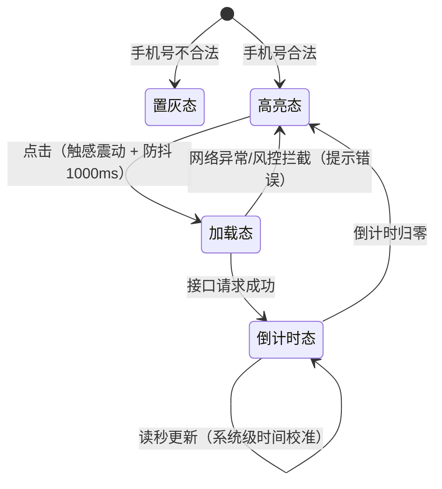

# SenseCare Product Master（PRD）使用说明

## 概述

这是一个用于撰写、扩写或评审产品需求文档（PRD）的高级产品经理技能。该技能强制使用严格的序号层级、纯中文表达，覆盖全场景微交互规范，并支持自动生成 Mermaid 图表图片。

## Mermaid 图表自动生成功能

### 功能说明

该技能支持在生成或更新 PRD 文档时，自动将 Mermaid 代码转换为 PNG 图片。图片会保存在 PRD 文件所在目录的 `mermaid-images/` 文件夹中。

### 工作原理

1. 当使用该技能生成或更新 PRD 文档时，会自动扫描文档中的 Mermaid 代码块。
2. 对每个 Mermaid 代码块进行渲染，生成对应的 PNG 图片。
3. 将图片嵌入到 PRD 文档中对应的图表位置。
4. 图片会自动覆盖，不需要保存历史版本。

### 文件结构

```text
PRD 文件所在目录/
├── PRD文件名.md              # PRD 文档
└── mermaid-images/           # Mermaid 生成的图片文件夹
    ├── diagram1.png          # 第一个图表
    ├── diagram2.png          # 第二个图表
    └── ...                   # 更多图表
```

### 示例

````markdown
### 4. 流程与状态图表 (Mermaid)

*(此处展示内嵌的 Mermaid 短信验证码发送状态转换图)*


### 5. 附录 (Appendix)
**UML 源码归档**

````

## 使用方法

### 1. 生成新 PRD

当使用该技能生成新的 PRD 时，会自动创建 `mermaid-images/` 文件夹并生成对应的图片文件。

### 2. 更新现有 PRD

当更新现有 PRD 时，会自动重新生成所有 Mermaid 图表图片，并覆盖原来的图片。

### 3. 图表源码归档

PRD 的最后必须保留所有 Mermaid 原始代码块，方便后续维护人员直接复用和修改。

## 注意事项

1. 如果 PRD 文件中没有 Mermaid 代码块，不会生成图片文件夹。
2. 图片会自动覆盖，不需要保存历史版本。
3. Mermaid 图表应放在对应模块的功能说明位置，附录中保留同一份原始代码。
4. 复杂状态流转、系统间时序、流程判断和多角色协同时，应优先补充 Mermaid 图表，避免只用文字描述。